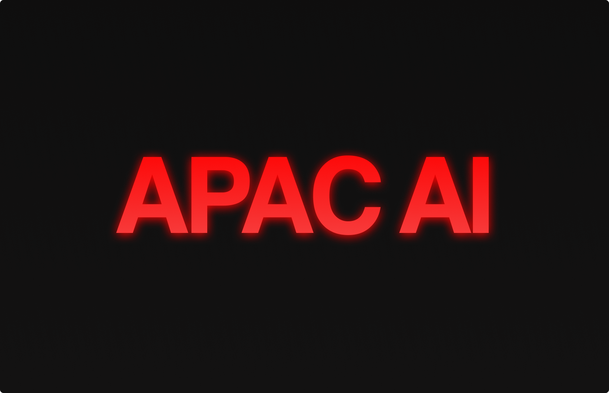

# APAC AI

Welcome to APAC AI. Our mission is to revolutionize the way humanity interacts with AI, promoting a future where creators can fully unleash their raw potential and redefine the very fabric of computer interaction. We are the minds behind projects such as Swarms, Andromeda, Kosmos, CyberTron, and Agora, our open-source research division. We're an Human first collective of Humans utilizing an open source for-profit approach to leverage economics and ultimately bring forth an post-scarcity Human civilization

----------

## Our Vision
Our purpose is to accelerate Humanity into an era of post-scarcity and endless abundance. We believe in the potential of Multi-Modality AI as the key that will unlock the full spectrum of human creativity. At APAC AI, we're not just developing technology; we're creating the future.

------

## Architecture and Business Model
Our structure is unique. We operate as an open-source for-profit organization, focusing on delivering transcendental AI services to our clients. Our business model relies heavily on our vast community of freelancers. Developers, salespeople, and AI enthusiasts from around the globe come together under the banner of APAC AI, each contributing their unique skills and perspectives to our collective effort.

Our ecosystem consists of several ground-breaking projects such as Swarms, Andromeda, Kosmos, CyberTron, and Agora, each making key contributions to the field of AI research and development. These projects not only represent the best of what we have to offer but also serve as the foundation upon which we continue to build and innovate.

------

## Stellar Projects
In our cosmic quest to reshape the future, several key projects serve as guiding stars. 

- 🔭 **[Andromeda](https://github.com/kyegomez/Andromeda)**: Our ultra-fast foundation language model and bridge to advanced AI reasoning.
- 🌑 **[Kosmos-X](https://github.com/kyegomez/Kosmos-X)**: A multi-modality foundation model leading us towards interconnected AI systems.
- 🌍 **[Swarms](https://github.com/kyegomez/swarms)**: Facilitating AI agent swarms and pioneering the frontier of distributed AI tasks and crowd-based learning.

----

- 🤖 **[CyberTron](https://github.com/kyegomez/CyberTron)**:  A Suite of SOTA Robotic Multi-Modality Multi-Embodied Transformer models for robotics
- 🖲 **[TerraByte](https://github.com/kyegomez/TerraByte)**: Modeling Billion+ long sequences of omni-modality byte sequences
- 🦄 **[PegasusX](https://github.com/kyegomez/Pegasus)**: An seamless easy to use embedding model to embed images, audio, text, sensor data, heat maps, and much much more in a unifed manner.

------

- 📊 **[The Domain](https://github.com/kyegomez/The-Domain)**: A conversational platform to utilize Multi-Modality models and swarms in a fluid experience with access to integrate 100s of tools and conduct data analysis across your digital data life.
- 🔎 **[Athena for Search](https://github.com/kyegomez/Athena-for-Search)**: The World's first AI-Powered Multi-Modality Native Search Engine that can understand knowledge in images, videos, audio, and many other forms of data! [Try it here](https://search.apac.ai/)

----

## Governance
Our governance model values decentralization and collective decision-making. Our projects are led by a core team of dedicated developers, but every contributor has a voice in how we grow and evolve. Through our unique approach, we ensure that APAC AI remains at the forefront of AI technology and continues to push the boundaries of what is possible.

-----

## Becoming a Part of APAC AI
Interested in joining our organization? We are always seeking talented individuals passionate about AI to contribute to our mission. Whether you're a developer looking to write code for the next big AI breakthrough or a salesperson ready to bring our services to more clients, we have opportunities for you.

Contributors can join on a project-by-project basis, working in a flexible, result-oriented environment. With APAC AI, you have the freedom to choose your commitment level, whether you want to contribute a few hours a week or dedicate yourself full-time.

-----

## Hiring
APAC AI is actively seeking ML + AI Engineers to work on democratizing SOTA Multi-Modality Foundation Models and devoted Sales Development Professionals who want to provide the next generation of AI models to customers around the globe to learn more submit an issue or email me `kye@apac.ai`

The Automated Public Assistance Coporation only hires full-time members based on quality previous contributions.

----

## Contact
Reach out to us at [kye@apac.ai](mailto:kye@apac.ai) for any queries or suggestions.

At APAC AI, we believe that with the right mix of talented individuals, cutting-edge technology, and an open-source, collaborative approach, we can become the largest corporation of our kind. We invite you to join us on this exciting journey. Together, let's redefine the future of AI.

------

# Roadmap

Andromeda and Kosmos are poised to redefine the intersection of language, understanding, and AI, heralding a new era of innovation and growth. Our mission is resolute: we aim to generate $50M monthly recurring cashflow by the end of 2023 while maintaining an astonishing 90% profit margin with a 5% week growth rate target. Here's our roadmap.

## Phase 1: Monetization of Andromeda and Kosmos

1. **PAID API:** Begin offering a paid API service for Andromeda and Kosmos. (Estimated starting price: $0.01 per API call)

2. **The Domain:** Monetize access to The Domain, allowing users to leverage its unique capabilities. (Estimated starting price: $25)

3. **Dedicated Capacity:** Sell dedicated computational power for Andromeda and Kosmos for exclusive usage. (Estimated starting price: $99,999/month)

4. **Hosted Fine-Tuning:** Provide fine-tuning services, offering bespoke solutions to businesses. (Estimated starting price: $500 per hour)

## Phase 2: Monetization of Swarms

1. **Paid API:** Provide a paid API service for Swarms, facilitating high-performing computations. (Estimated starting price: $0.01 per API call)

2. **The Domain:** Utilize The Domain as an additional avenue for revenue. (25$ at 100 messages every 12 hours )

3. **Dedicated Capacity:** Offer exclusive computational power to Swarms for dedicated usage. (Estimated starting price: $299,999/month)

## Phase 3: Monetization of The Domain

1. **Freemium Subscription:** Launch a tiered subscription model for The Domain, from everyday users to large-scale businesses. (Estimated starting prices: $0/month for Basic, $25/month for Individuals, $299/month for Small Businesses, $999/month for Medium Businesses, and $4,999/month +  for Large Businesses)

2. **Usage Performance Fee:** Implement a performance-based fee on top of subscription costs, charging more for higher usage rates. (Estimated starting price: 2% of usage cost)

## Phase 4: Massive Scale Monetization

1. **Broaden Market Scope:** Aggressively expand our customer base, targeting a diverse range of industries, from healthcare and education to government and tech companies.

2. **Enhance Product Offerings:** Continually improve our services, ensuring we stay at the cutting edge of AI development and deliver unparalleled value to our customers.

3. **Strategic Partnerships:** Develop strategic alliances with tech companies, promoting shared growth and increasing our market reach.

4. **Community Engagement:** Foster a strong developer community, incentivizing contributions and ensuring continuous innovation.

By adhering to this roadmap, we can confidently stride towards our goal of achieving massive-scale monetization. Each phase will bring us closer to realizing our ambition, setting a new standard in the AI landscape. Andromeda, Kosmos, and Swarms – together, we can change the world.

### Key Performance Metrics

To maintain our growth trajectory and stay on the course of being both profoundly service-oriented and unimaginably profitable, we focus on three non-vanity metrics:

1. **Customer Lifetime Value (CLTV)**: CLTV measures the net profit we make from any customer during the time they are paying for our service. It's not just about acquiring users; it's about acquiring profitable users. This metric directly reflects both our ability to retain customers and the profitability of those customers.

2. **Net Dollar Retention (NDR)**: NDR shows how well we’re monetizing our existing customers. It captures upsells, cross-sells, downgrades, and churn. A high NDR means that our revenues from existing customers are growing, even if we don’t add new customers, which is crucial for maintaining high profit margins.

3. **Customer Acquisition Cost (CAC) Ratio**: CAC Ratio measures the profitability of our customer acquisition efforts. It shows how much we earn from a customer in the first year of their subscription compared to what we spent to acquire them. A higher ratio signifies greater efficiency and profitability.

By focusing on these metrics, we are committed to building a business that doesn’t just grow but scales in a sustainable, profitable manner. Let's change the world together.

---
APAC AI. *Advancing Humanity.*