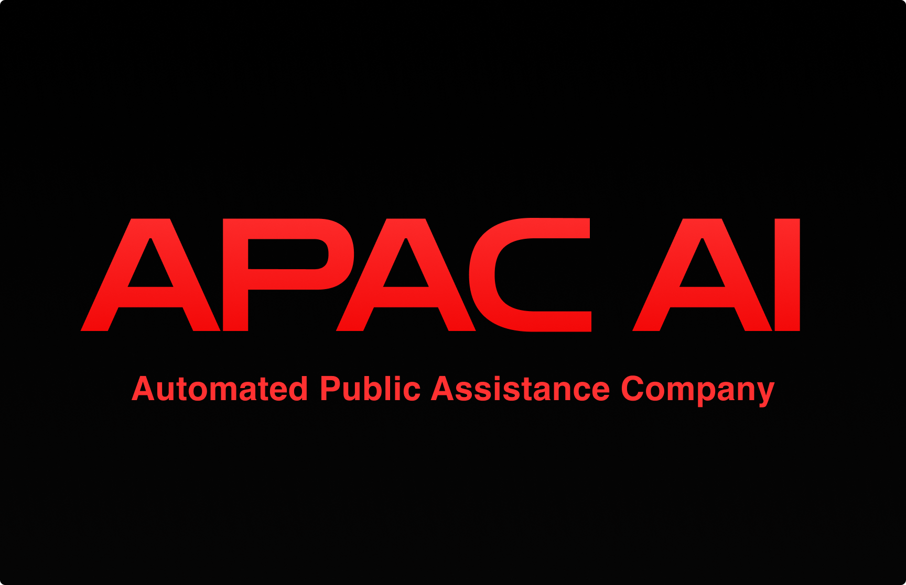

# APAC AI

Welcome to APAC AI. We're an open source for-profit corporation. Our mission is to revolutionize the way humanity interacts with AI, promoting a future where creators can fully unleash their raw potential and redefine the very fabric of computer interaction. We are the minds behind projects such as Swarms, Andromeda, Kosmos, CyberTron, and Agora, our open-source research division.

## Our Vision
Our purpose is to accelerate Humanity into an era of post-scarcity and endless abundance. We believe in the potential of Multi-Modality AI as the key that will unlock the full spectrum of human creativity. At APAC AI, we're not just developing technology; we're creating the future.

## Architecture and Business Model
Our structure is unique. We operate as an open-source for-profit organization, focusing on delivering transcendental AI services to our clients. Our business model relies heavily on our vast community of freelancers. Developers, salespeople, and AI enthusiasts from around the globe come together under the banner of APAC AI, each contributing their unique skills and perspectives to our collective effort.

Our ecosystem consists of several ground-breaking projects such as Swarms, Andromeda, Kosmos, CyberTron, and Agora, each making key contributions to the field of AI research and development. These projects not only represent the best of what we have to offer but also serve as the foundation upon which we continue to build and innovate.

## Stellar Projects
In our cosmic quest to reshape the future, several key projects serve as guiding stars. 

- 🔭 **Andromeda**: Our ultra-fast foundation language model and bridge to advanced AI reasoning.
- 🌑 **Kosmos-X**: A multi-modality foundation model leading us towards interconnected AI systems.
- 🌊 **Ocean**: Our ultra-reliable vector database that forms the backbone for multi-modal data processing.
- 💫 **StarLight Vision**: A glimpse into the future of content creation, with text-to-video generation.
- 🌍 **Swarms**: Facilitating AI agent swarms and pioneering the frontier of distributed AI tasks and crowd-based learning.

## Governance
Our governance model values decentralization and collective decision-making. Our projects are led by a core team of dedicated developers, but every contributor has a voice in how we grow and evolve. Through our unique approach, we ensure that APAC AI remains at the forefront of AI technology and continues to push the boundaries of what is possible.

## Becoming a Part of APAC AI
Interested in joining our organization? We are always seeking talented individuals passionate about AI to contribute to our mission. Whether you're a developer looking to write code for the next big AI breakthrough or a salesperson ready to bring our services to more clients, we have opportunities for you.

Contributors can join on a project-by-project basis, working in a flexible, result-oriented environment. With APAC AI, you have the freedom to choose your commitment level, whether you want to contribute a few hours a week or dedicate yourself full-time.

## Hiring
APAC AI is actively seeking ML + AI Engineers to work on democratizing SOTA Multi-Modality Foundation Models and devoted Sales Development Professionals who want to provide the next generation of AI models to customers around the globe to learn more submit an issue or email me `kye@apac.ai`

The Automated Public Assistance Coporation only hires full-time members based on quality previous contributions.

## Contact
Reach out to us at [kye@apac.ai](mailto:kye@apac.ai) for any queries or suggestions.

At APAC AI, we believe that with the right mix of talented individuals, cutting-edge technology, and an open-source, collaborative approach, we can become the largest corporation of our kind. We invite you to join us on this exciting journey. Together, let's redefine the future of AI.

---
APAC AI. *Advancing Humanity.*